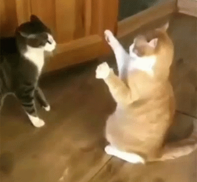
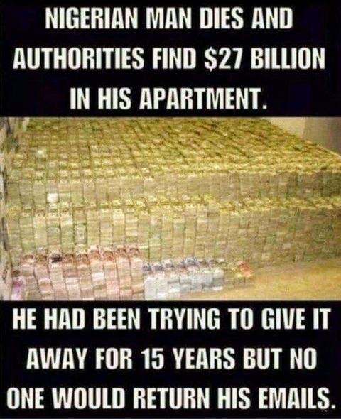
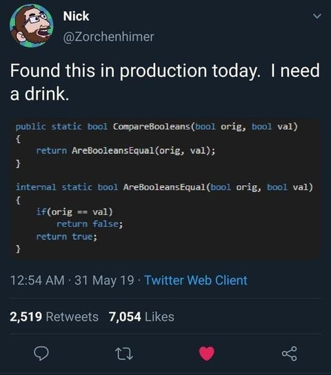
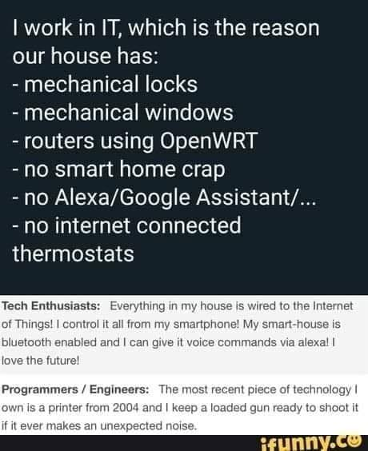

# LOLZ

The rules are simple.

- Fork the repo
- Make a new branch
- Edit the README.md file
- `git commit` the branch
- Open a PR for your new branch against this repo
- Profit

Please keep the humour clean, light and without prejudice. Rule breakers won't get their PRs merged.

# Jokez

```
Q. Why couldn't 4 ask 5 out on a date?
A. Because he was 2²
```

```
Q. What did the man say after digging three holes in the yard?
A. “Well, well, well”
```

```
Q. Why did the can crusher quit his job?
A. Because it was soda pressing
```

```
Q. What's the best thing about UDP jokes
A. I don't care if you get them
```

# GIFz

Post leg-day in the gym:



# Memez

So, it was true!:



What is the point?



LOL, exactly!




# Videoz

Clever Cat!

[](https://www.youtube.com/watch?v=OKsyMxUX7R0)
